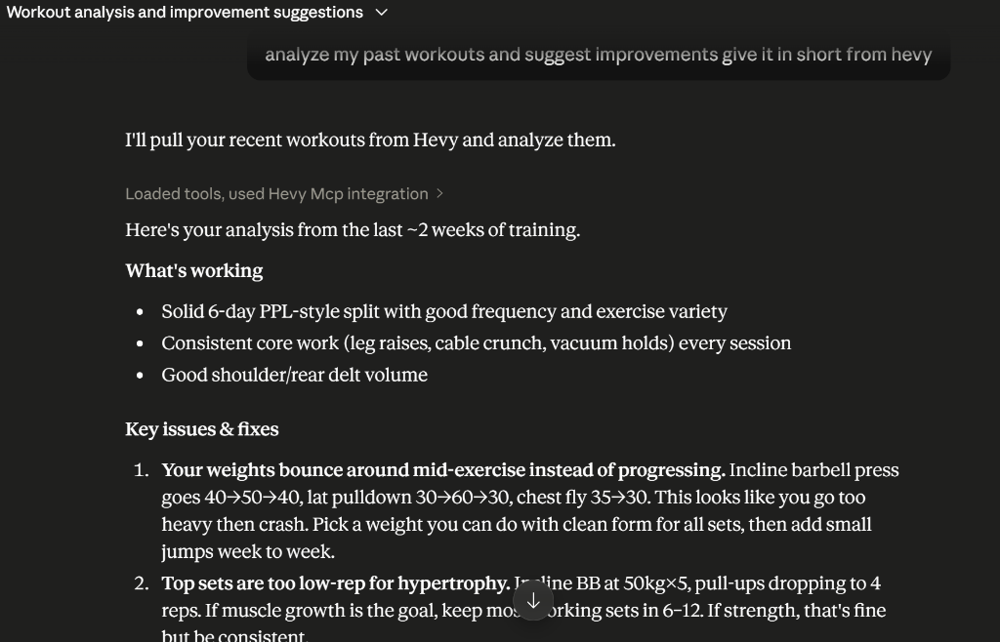
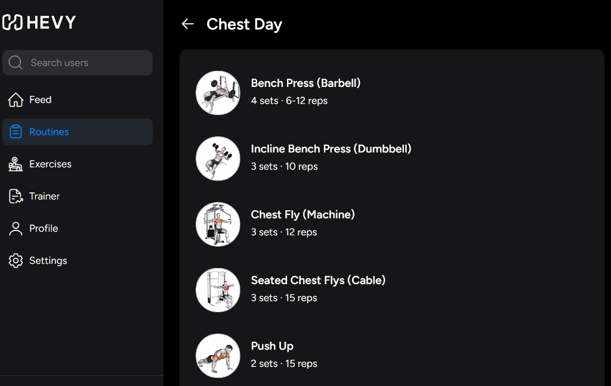
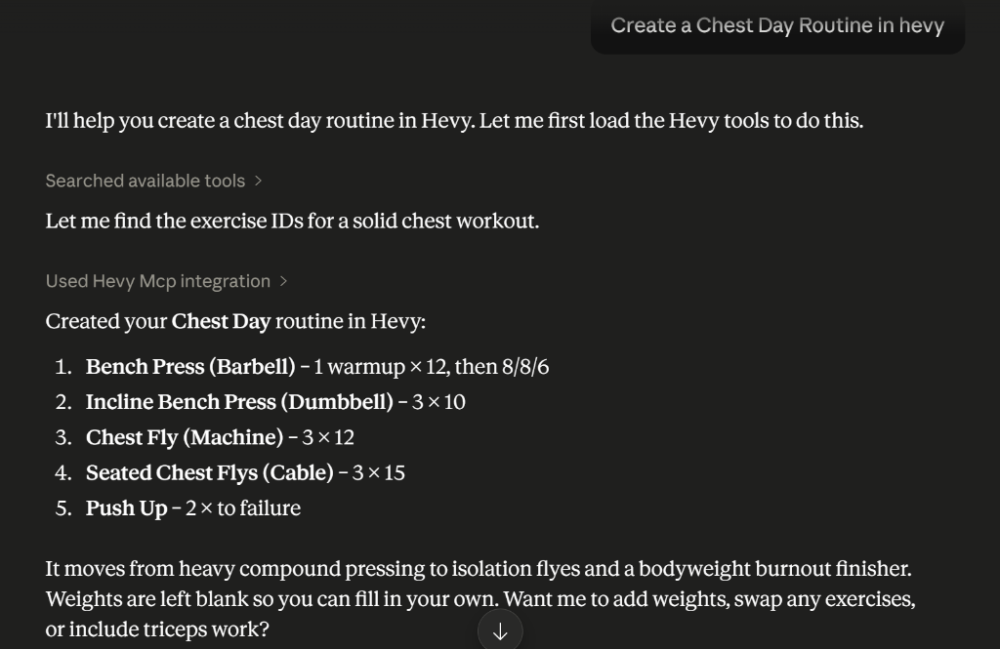

# 🏋️‍♂️ Hevy MCP Server

A fully-featured [Model Context Protocol (MCP)](https://modelcontextprotocol.io/) server that seamlessly integrates the [Hevy Workout Tracker](https://www.hevyapp.com/) API directly into AI assistants like Claude. 

This project empowers AI models to natively read, create, update, and search your Hevy workout routines and exercise data through natural language commands, effectively acting as an intelligent personal trainer and data manager.

## ✨ Features

- **Read Live Data:** Fetch your recent workouts and saved routines instantly.
- **Create & Update Routines:** Tell your AI to "Create a Chest Day routine" or "Add Bicep Curls to Day 1", and watch it automatically execute the API calls to update your Hevy account.
- **Intelligent Exercise Search:** Features a custom search tool that allows the AI to query Hevy's massive exercise template database to find precise `exercise_template_id`s completely autonomously.
- **Cloud-Ready SSE Transport:** Built with a custom Express.js layer and Server-Sent Events (SSE) to bypass standard local MCP limitations. This allows the server to be hosted on cloud platforms (like Render or Vercel) and connected directly to a mobile AI client without needing a PC running 24/7.
- **Bypass Authentication:** Includes a clever OAuth-bypass mechanism to seamlessly connect to Claude's strict Custom Connector authentication flow.

## 🚀 Why I Built This

The main reason I built this was to solve a personal pain point: **I was tired of manually taking screenshots of my daily workouts and sending them to an AI to get feedback.** 

I wanted a way to analyze my own workouts, track my progress over time, and get intelligent recommendations without the friction of manual data entry. By building this MCP server, I completely automated that pipeline. Now, my AI assistant has direct, real-time access to my Hevy workout history. It can instantly see what I did yesterday, analyze my volume, and recommend exactly what I should do today—all natively within the chat interface.

## 🛠️ Technology Stack

- **TypeScript / Node.js**
- **Model Context Protocol (MCP) SDK**
- **Express.js** (Custom SSE routing and OAuth spoofing)
- **Zod** (Robust schema validation for AI tool calls)
- **Hevy REST API**

## 📖 How It Works

1. **The Request:** The user tells the AI (e.g., Claude app on iOS/Android): *"Add Cable Crunches to my Monday Routine."*
2. **The Search:** The AI automatically invokes the `search_exercises` MCP tool. The Express server queries the Hevy API, filters the results, and returns the unique template ID for "Cable Crunch".
3. **The Execution:** The AI then invokes the `update_routine` MCP tool with the correct payload and schema. The server translates this into an authenticated `PUT` request to Hevy's official servers.
4. **The Result:** The user's routine is updated instantly in their Hevy app.

## ⚙️ Local Development Setup

1. Clone the repository.
2. Install dependencies: `npm install`
3. Add your Hevy API Key to a `.env` file: `HEVY_API_KEY=your_key_here`
4. Build the project: `npm run build`
5. Start the server: `npm start`

## ☁️ Deployment (Render)

This project is designed to be easily hosted on Render so it can run 24/7 without needing your PC.

1. Create a new **Web Service** on Render and connect this GitHub repository.
2. Set the Build Command to: `npm install && npm run build`
3. Set the Start Command to: `npm start`
4. In Environment Variables, add: `HEVY_API_KEY` (Your Hevy Developer API Key)
5. Deploy! Your server will be live at `https://your-app-name.onrender.com`

## 🤖 Connecting to Claude

To link this live server to your Claude app:

1. Open Claude and go to **Settings > Custom Connectors**.
2. Create a new Connector.
3. Provide the Base URL: `https://your-app-name.onrender.com`
4. Because this server uses an OAuth-spoofing mechanism to bypass strict login flows:
   - For **Authorization URL**, use: `https://your-app-name.onrender.com/authorize`
   - For **Token URL**, use: `https://your-app-name.onrender.com/token`
   - Enter any random string for the Client ID and Client Secret.
5. Claude will seamlessly "authenticate" and establish an SSE connection to the server!

## 📸 Screenshots

*(Highly Recommended for your Resume/Portfolio! Replace these placeholders with actual screenshots of your workflow)*

Click to view Screenshots

### 1. The Request in Claude
*(Claude intelligently searching for exercise IDs and executing the MCP `create_routine` tool)*

### 2. The Hevy App Updating Live
*(The official Hevy App instantly reflecting the newly created Chest Day routine)*

### 3. Automated Routine Analysis
*(Claude successfully analyzing past workouts and suggesting actionable improvements)*

